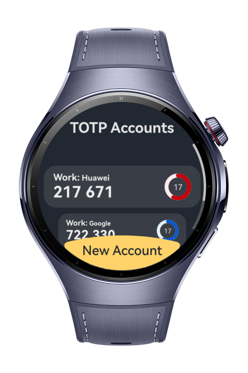
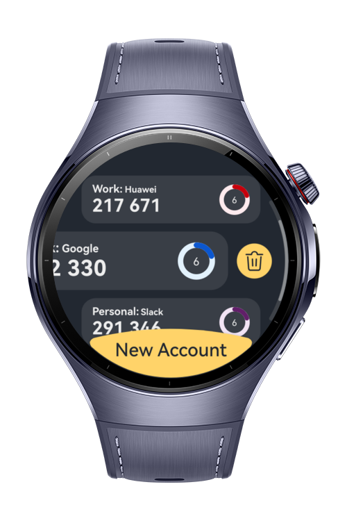
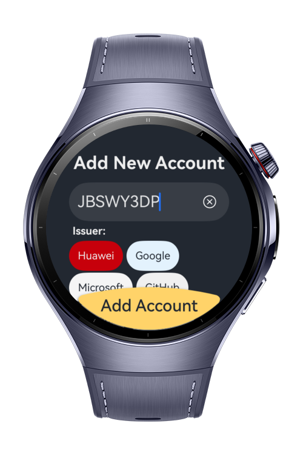

> **Note:** To access all shared projects, get information about environment setup, and view other guides, please visit [Explore-In-HMOS-Wearable Index](https://github.com/Explore-In-HMOS-Wearable/hmos-index).

# Wrist Auth

**TOTP Authenticator** – 2FA codes on your wrist.

A secure and lightweight app for HarmonyOS NEXT Wearable.
It generates time-based one-time passwords (TOTP) for two-factor authentication, working fully offline and supporting
popular services like Huawei, Google, Microsoft, and GitHub.

# Preview

<div>
  
  
  
</div>

# Use Cases

- Secure login for services like Huawei, Google, Microsoft, GitHub, and more.
- Access authentication codes directly on your smartwatch without a phone.
- Generate valid codes offline, without internet or mobile connection.
- Manage multiple accounts, both personal and work, in one place.
- Add an extra layer of protection for gaming, shopping, and financial accounts.

# Technology

## Stack

- **Languages**: ArkTS, Typescript
- **Frameworks**: HarmonyOS SDK 5.1.0(18)
- **Tools**: DevEco Studio Version 5.1.0.828
- **Libraries**:
    - `@kit.ArkUI`
    - `@kit.AbilityKit`
    - `@kit.ArkData`
    - `@kit.BasicServicesKit`
    - `@kit.CryptoArchitectureKit`
    - `@kit.PerformanceAnalysisKit`

## TOTP Generation with CryptoArchitectureKit

This project implements the standard **TOTP algorithm (RFC 6238)** to generate time-based one-time passwords.

- **Algorithm**
    - Counter is calculated from the current Unix timestamp divided by the account period (default: 30 seconds).
    - The Base32-encoded secret is decoded into raw bytes.
    - HMAC is applied with the secret and counter, using SHA-1, SHA-256, or SHA-512.
    - Dynamic truncation extracts the final numeric value, padded to the configured number of digits (default: 6).

- **Crypto**
    - Built on **@kit.CryptoArchitectureKit** for secure HMAC computation.
    - `cryptoFramework.createMac()` is used with `cryptoFramework.SymKey` key generated
      using `cryptoFramework.createSymKeyGenerator('HMAC')` .
    - All operations are performed locally, ensuring that secrets never leave the device.

## Dependency Injection (Registry-Based)

This project includes a lightweight, custom **Dependency Injection (DI)** system, implemented with decorators and a
central service registry.

- Services are registered in `MainRegistry.ets` using `@Register()` decorators
- Classes can `@Resolve()` dependencies without manually wiring them
- Lazy and singleton services are supported via internal `ServiceRegistry.ts`

Example files:

- `src/main/ets/di/MainRegistry.ets` – Application-level service registration uses `@Register` to register a service.
- `src/main/ets/registry/Injectable.ts` – `Injectable` Interface, used to mark any class that will be injected later.
- `src/main/ets/registry/ServiceRegistry.ts` – Core service container, also has `@Register`, `@Resolve` decorators.

This allows separation of concerns and improved testability for components like:

- `AppDatabase` with it's implementation class `AppDatabaseImpl`
- ViewModels and utilities

# Directory Structure

```
├── entry/src/main/ets/
│   ├──components/                      // Reusable UI components
│   ├──constants/                       // Constants like sizes
│   ├──database/
│   │  ├──tables/                        
│   │  │  ├──RDBTable.ets               // Common table interface for create + indexes + columns
│   │  │  └──TotpCodeTable.ets          // TOTP Codes table schema, indexes and columns
│   │  ├──AppDatabase.ets               // Database abstraction (methods for CRUD + queries)
│   │  ├──AppDatabaseImpl.ets           // Implementation of AppDatabase using RDB APIs
│   │  └──RDBBuilder.ets                // Builder utility to open DB, build tables
│   ├──di/                              // DI container and main registry
│   ├──entryability/
│   │  └──EntryAbility.ets              // Main entry point ability
│   ├──entrybackupability/
│   │  └──EntryBackupAbility.ets        // Backup entry ability
│   ├──model/                           // Data models (LabelOption, TotpCode)
│   ├──myabilitystage/
│   │  └──MyAbilityStage.ets            // Custom AbilityStage for config setup
│   ├──pages/
│   │  ├──AddTotpAccountPage.ets        // UI for creating a new TOTP Account
│   │  ├──Index.ets                     // App start page / navigation root
│   │  └──TotpAccountsPage.ets          // UI listing all TOTP Accounts
│   ├──registry/                        // Decorators and DI service registry
│   ├──totp/
│   │  ├──TotpCommon.ets                // TOTP common types and maps (TotpAlgoType, CodesMap, RemainingMap)
│   │  ├──TotpManager.ets               // Holding static TOTP generation and Byte converting functions
│   │  └──TotpScheduler.ets             // Handles TOTP codes refreshing with remaining time left for code to expire
│   ├──utils/
│   │  ├──Base32.ets                    // Base32 (RFC4648) decoding and validing functions 
│   │  └──Logger.ets                    // Logging utility
│   └──viewmodel/
│      ├──datasource/                   // Data source feeding ViewModel with prepared arrays (refresh, delete, add) data
│      ├──AccountsDataSource.ets        // Data source feeding ViewModel with prepared arrays (refresh, delete, add) data
│      ├──AddTotpAccountViewModel.ets   // Handles state & logic for adding a new TOTP account
│      └──AccountsViewModel.ets         // Handles TOTP accounts list
```

# Constraints and Restrictions

## Supported Devices

- Huawei Watch 5

# License

**Wrist Auth** is distributed under the terms of the MIT License.
See the [license](/LICENSE) for more information.